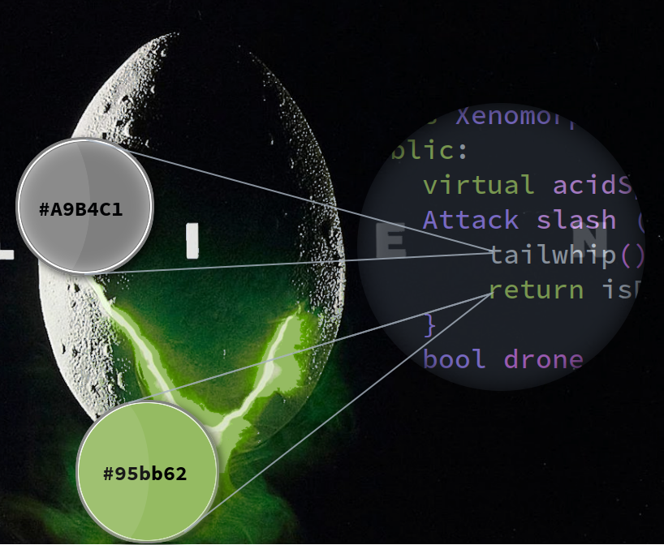
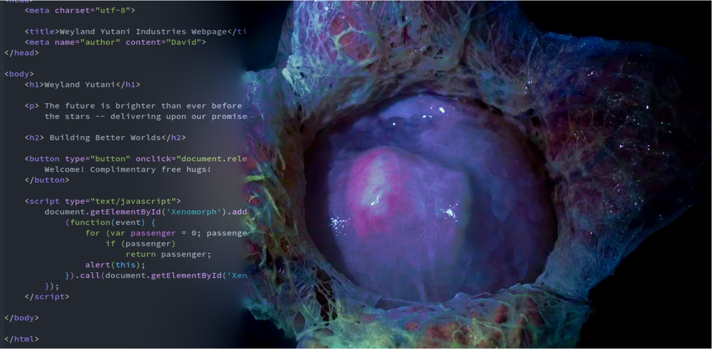

<h3 align="center">Weyland Yutani Emacs Theme</h3>
<hr/>

<p align="center">
 <!--  width=1900 -->
 <!--  width=1900 -->

</p>

<br/>

<p align="center">An emacs theme based on the Alien movie franchise.</p>

### Loading the theme:


Download `weyland-yutani-theme.el` and put it under `~/.emacs.d/themes/` (or `~/.config/emacs/themes/`), then add these lines to your `init.el`:

``` elisp
(add-to-list 'custom-theme-load-path "~/.emacs.d/themes/")
# or 
(add-to-list 'custom-theme-load-path "~/.config/emacs/themes/")

(load-theme `weyland-yutani t)
```
Also if you use [highlight-parentheses](https://github.com/tsdh/highlight-parentheses.el/tree/e18f2c2b240d7586ff7ffdc2881079e2dd8944ca)
(spacemacs does) I recommend using the following setting to put in your init file:

``` elisp
  (setq hl-paren-colors '("#000000"))
  (setq hl-paren-background-colors '("#B376D2"))
```
